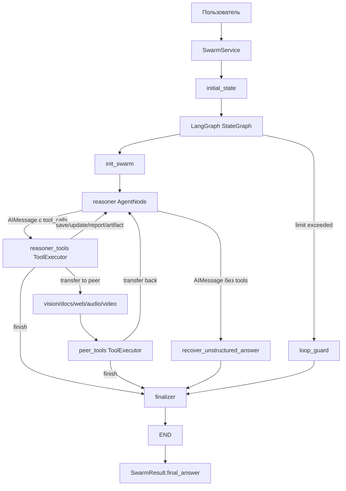
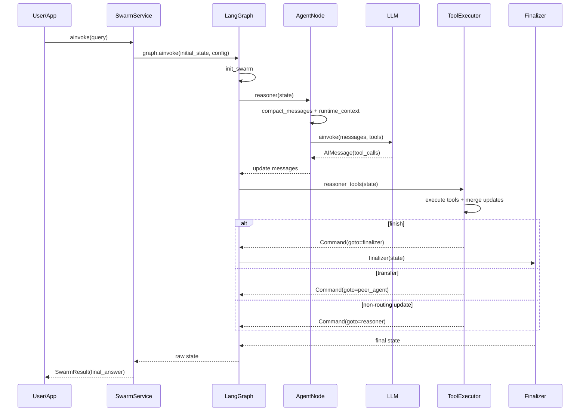
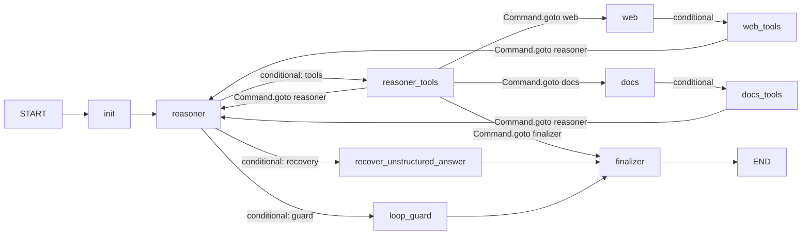
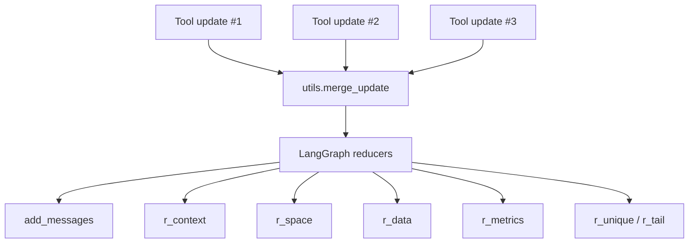
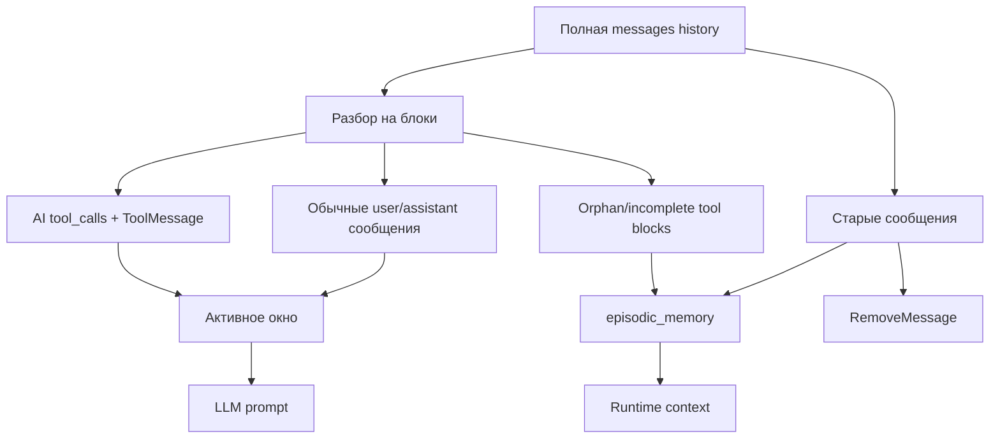
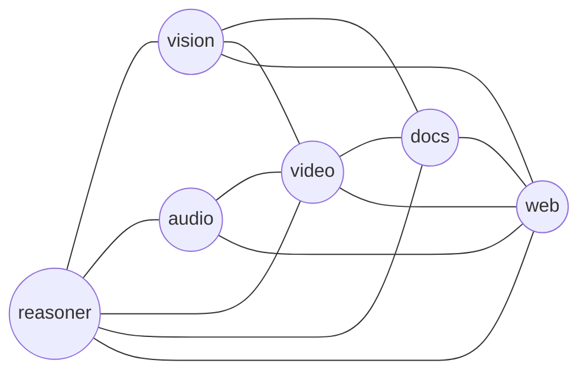
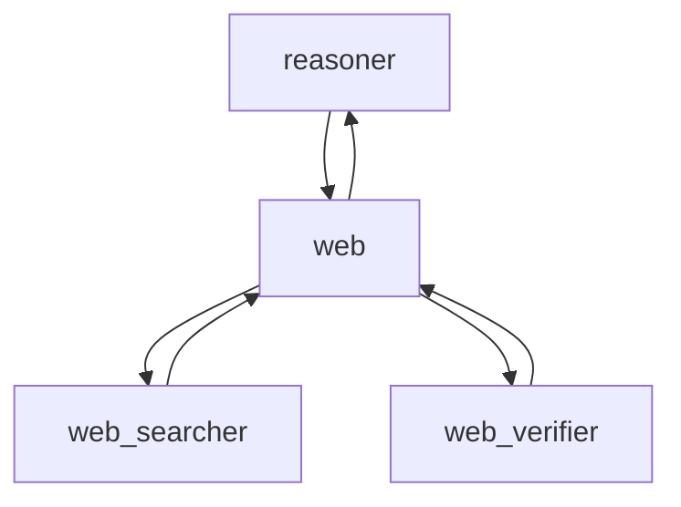
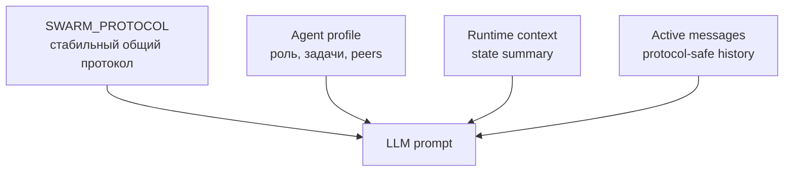
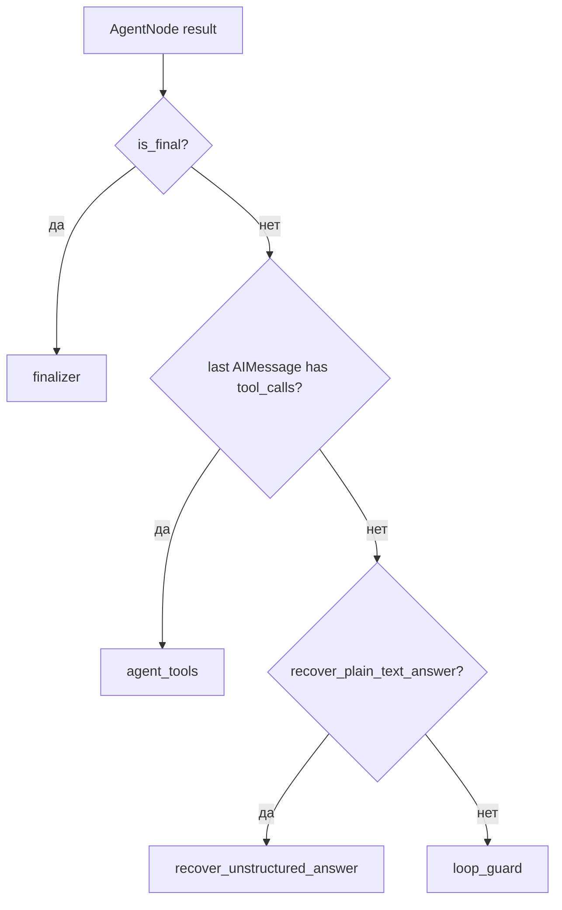
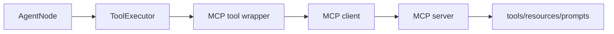

# Swarm Agent Service v0.6.0

> Подробный production README-гайд по асинхронному сервису роя агентов на LangGraph для Python 3.12.
>
> Документ описывает архитектуру, порядок работы, state, reducers, routing, tool-calling, сжатие контекста, LLM/HTTP-слой, тестирование, эксплуатацию и план дальнейшего масштабирования.

---

## Содержание

1. [Что это за сервис](#что-это-за-сервис)
2. [Главные свойства системы](#главные-свойства-системы)
3. [Быстрый старт](#быстрый-старт)
4. [Минимальный пример использования](#минимальный-пример-использования)
5. [Зависимости](#зависимости)
6. [Структура проекта](#структура-проекта)
7. [Архитектурная карта](#архитектурная-карта)
8. [Порядок работы одного запроса](#порядок-работы-одного-запроса)
9. [LangGraph-граф](#langgraph-граф)
10. [State: каналы данных](#state-каналы-данных)
11. [Reducers: как данные не теряются](#reducers-как-данные-не-теряются)
12. [Сжатие контекста](#сжатие-контекста)
13. [Агенты и подагенты](#агенты-и-подагенты)
14. [Промпты и token efficiency](#промпты-и-token-efficiency)
15. [Инструменты](#инструменты)
16. [ToolExecutor и параллельные tool calls](#toolexecutor-и-параллельные-tool-calls)
17. [Routing и финализация](#routing-и-финализация)
18. [LLM/HTTP слой](#llmhttp-слой)
19. [SwarmService API](#swarmservice-api)
20. [Streaming](#streaming)
21. [Конфигурация через env](#конфигурация-через-env)
22. [Логирование Loguru](#логирование-loguru)
23. [Тестирование](#тестирование)
24. [Как добавлять агентов](#как-добавлять-агентов)
25. [Как добавлять инструменты](#как-добавлять-инструменты)
26. [Как подключить web/docs/vision/audio/video инструменты](#как-подключить-webdocsvisionaudiovideo-инструменты)
27. [MCP, удалённые агенты и A2A](#mcp-удалённые-агенты-и-a2a)
28. [LangSmith и Langfuse](#langsmith-и-langfuse)
29. [Производительность и оптимизация](#производительность-и-оптимизация)
30. [Безопасность](#безопасность)
31. [Production checklist](#production-checklist)
32. [Troubleshooting](#troubleshooting)
33. [Roadmap масштабирования](#roadmap-масштабирования)
34. [Глоссарий](#глоссарий)

---

## Что это за сервис

`swarm-agent-service` — это асинхронный сервис мультиагентного роя. Он построен вокруг идеи, что несколько специализированных агентов могут совместно решать задачу пользователя через общий state, явные handoff-инструменты и контролируемый LangGraph-граф.

Сервис не является demo-скриптом. Это каркас production-сервиса, в котором уже заложены:

- строгий `async-only` runtime;
- LangGraph `StateGraph` с управляемой маршрутизацией;
- общий state роя с Pydantic-моделями и reducers;
- сжатие истории сообщений без разрыва tool-call протокола;
- системные инструменты `save_findings`, `update_context`, `submit_artifact`, `report_error`, `transfer`, `finish`;
- поддержка parent/child агентов;
- параллельное выполнение независимых non-routing tools;
- детерминированная обработка routing tools;
- единый application-facing фасад `SwarmService`;
- безопасные пользовательские fallback-сообщения;
- Loguru-логирование;
- заготовки под будущие категории инструментов: `web`, `docs`, `vision`, `audio`, `video`;
- тесты на скрытые edge cases: reducers, routing, compaction, tool executor, конфигурация, static audit.

Цель архитектуры — не заставить LLM бесконтрольно ходить по агентам, а создать управляемую среду, где модель принимает решения, но Python-код удерживает инварианты: не терять state, не ломать message history, не запускать бесконечные циклы и всегда возвращать пользователю нормальный ответ.

---

## Главные свойства системы

| Свойство | Что это значит |
|---|---|
| Python 3.12 | Проектный контракт: `requires-python = ">=3.12,<3.13"`. Используются современные type aliases. |
| Async-only | Нет sync API, sync HTTP-клиентов и CLI. Сервис рассчитан на FastAPI/worker/event-loop окружение. |
| LangGraph | Граф управляет шагами агентов, state updates, conditional routing и checkpoints. |
| OpenAI-compatible LLM | Используется `ChatOpenAI` поверх OpenRouter-compatible endpoint. |
| Общий state | Агенты не передают друг другу огромный текст напрямую, а пишут структурированные данные в общий state. |
| Context compaction | Старые сообщения сжимаются в `space.episodic_memory`, активное окно остаётся protocol-safe. |
| Deterministic tools | Системные tools возвращают `Command(update=..., goto=...)`. |
| Parallel tools | Независимые non-routing tools могут выполняться параллельно, routing tools остаются одиночными. |
| Safe final answer | Пользователь получает `final_answer` или спокойное сообщение “попробуйте позже”, без stacktrace и internals. |
| Масштабируемая структура | Каталоги `agents`, `tools`, `runtime`, `state`, `llm`, `budget`, `graph`, `core` разделены по ответственности. |

---

## Быстрый старт

```bash
cd swarm_agent_service_final
python3.12 -m venv .venv
source .venv/bin/activate

pip install -U pip
pip install -e ".[dev]"

cp .env.example .env
# Открой .env и задай OPENROUTER_API_KEY или SWARM_OPENROUTER_API_KEY.
```

Проверка проекта:

```bash
python -m compileall -q src tests
pytest -q -rs
ruff check src tests
mypy src
```

Минимальный `.env`:

```env
OPENROUTER_API_KEY=sk-or-v1-...
SWARM_LOG_LEVEL=INFO
SWARM_LOG_JSON=false
```

---

## Минимальный пример использования

```python
import asyncio

from swarm_agent import SwarmService


async def main() -> None:
    async with SwarmService() as swarm:
        result = await swarm.ainvoke(
            "Кратко объясни, что умеет этот сервис",
        )
        print(result.final_answer)


asyncio.run(main())
```

Пример с persistent `thread_id`:

```python
import asyncio

from swarm_agent import SwarmService


async def main() -> None:
    thread_id = "demo-user-42"

    async with SwarmService() as swarm:
        first = await swarm.ainvoke(
            "Разложи задачу по шагам: построить web-инструмент",
            thread_id=thread_id,
        )
        print(first.final_answer)

        second = await swarm.ainvoke(
            "Теперь предложи интерфейс batch search tool",
            thread_id=thread_id,
        )
        print(second.final_answer)


asyncio.run(main())
```

Важно: persistent thread сохраняет историю через checkpointer, если он подключён. При новом run очищаются per-run scratch-каналы, но `space.episodic_memory` может сохранять сжатую память треда.

---

## Зависимости

Зависимости задаются в `pyproject.toml`.

| Пакет | Диапазон | Зачем нужен |
|---|---:|---|
| `langgraph` | `>=1.2.4,<2` | StateGraph, nodes, edges, `Command`, checkpoints, streaming. |
| `langchain-core` | `>=1.4.0,<2` | Messages, `RunnableConfig`, `BaseTool`, contracts для tool-calling. |
| `langchain-openai` | `>=1.2.2,<2` | `ChatOpenAI` для OpenAI-compatible endpoint OpenRouter. |
| `pydantic` | `>=2.13.4,<3` | Типизированные DTO, state-модели, валидация tool args. |
| `pydantic-settings` | `>=2.14.1,<3` | Настройки из env и `.env`. |
| `httpx[http2]` | `>=0.28.1,<1` | Async HTTP pool, таймауты, keep-alive, HTTP/2. |
| `orjson` | `>=3.11.9,<4` | Быстрая JSON-сериализация state/context. |
| `loguru` | `>=0.7.3,<1` | Runtime-логирование. |
| `pytest` | `>=9.0.3` | Тесты. |
| `pytest-asyncio` | `>=1.4.0` | Async-тесты. |
| `ruff` | `>=0.15.16` | Линтинг. |
| `mypy` | `>=2.1.0` | Статическая типизация. |

Почему нет sync-зависимостей и CLI:

- сервис должен жить в async-приложении;
- sync-path удваивает поверхность багов;
- один `httpx.AsyncClient` pool легче контролировать;
- тестирование становится проще и честнее.

---

## Структура проекта

```text
swarm_agent_service_final/
  .env.example
  LICENSE
  README.md
  REPORT.md
  SECURITY.md
  langgraph.json
  pyproject.toml

  docs/
    swarm_architecture_ru.html
    README_GUIDE_RU.md

  src/swarm_agent/
    __init__.py
    service.py
    types.py
    utils.py

    core/
      __init__.py
      config.py
      errors.py
      logging.py
      text.py

    agents/
      __init__.py
      registry.py
      prompts.py

    tools/
      __init__.py
      base.py
      cache.py
      system/
        __init__.py
        schemas.py
        factory.py
      web/
        __init__.py
      docs/
        __init__.py
      vision/
        __init__.py
      audio/
        __init__.py
      video/
        __init__.py

    budget/
      __init__.py
      compaction.py
      context.py

    graph/
      __init__.py
      bootstrap.py
      builder.py

    llm/
      __init__.py
      catalog.py
      profiles.py
      http.py
      hub.py

    runtime/
      __init__.py
      agent.py
      retry.py
      routing.py
      finalization.py
      tool_executor.py
      tool_protocol.py

    state/
      __init__.py
      models.py
      reducers.py
      schema.py
      snapshot.py

  tests/
    test_budget.py
    test_config_contract.py
    test_finalization.py
    test_project_layout.py
    test_registry.py
    test_runtime_routing.py
    test_state_reducers.py
    test_static_audit.py
    test_tool_executor.py
    test_tool_executor_mocked.py
```

### Как читать структуру

| Слой | Ответственность | Что нельзя делать в слое |
|---|---|---|
| `types.py` | Доменные модели, enum, DTO, лёгкие Pydantic-контракты. | Создавать HTTP-клиенты, импортировать LangGraph nodes, запускать side effects. |
| `core/` | Настройки, ошибки, логирование, текстовые helpers. | Знать конкретных агентов или tools. |
| `agents/` | Топология агентов и prompt-протокол. | Выполнять LLM calls. |
| `tools/` | Tool factories, schemas, metadata, категории инструментов. | Самостоятельно менять граф без `Command`. |
| `runtime/` | Узлы graph runtime: agent, routing, executor, finalization. | Хранить декларативные DTO, которые нужны всем слоям. |
| `state/` | LangGraph state schema, reducers, snapshot coercion. | Вызывать LLM или tools. |
| `budget/` | Сжатие message history и форматирование runtime context. | Менять routing graph. |
| `llm/` | Provider/model registry, HTTP pool, LLMHub. | Знать детали конкретных tools. |
| `graph/` | Сборка StateGraph. | Создавать graph на import-time обычного пакета. |
| `service.py` | Фасад для application-кода. | Содержать бизнес-логику агентов. |

---

## Архитектурная карта



Главная идея: LLM может предложить действие, но граф и executor решают, как безопасно выполнить это действие и куда идти дальше.

---

## Порядок работы одного запроса

1. Application вызывает `await SwarmService.ainvoke(query, ...)`.
2. `SwarmService.initial_state(...)` создаёт начальный state:
   - `messages` с `HumanMessage`;
   - `context.query`;
   - `workspace` с пустым ответом;
   - `in_files`, если переданы файлы;
   - `is_final=False`.
3. `SwarmService._config(...)` добавляет:
   - `configurable.thread_id`;
   - `recursion_limit`.
4. LangGraph запускает `init`.
5. `init_swarm` очищает per-run каналы и ставит `active_node=reasoner`.
6. `reasoner AgentNode`:
   - сжимает старые сообщения;
   - собирает runtime context;
   - вызывает LLM с system prompts, state context и active messages;
   - добавляет ответ модели в `messages`.
7. Router смотрит последний AIMessage:
   - есть `tool_calls` -> идём в `reasoner_tools`;
   - нет `tool_calls` -> recovery или loop guard.
8. `ToolExecutorNode` выполняет tools:
   - non-routing tools обновляют state и возвращают к агенту;
   - `transfer` передаёт управление peer-агенту;
   - `finish` переводит граф в `finalizer`.
9. `finalizer` нормализует `workspace.final_answer`.
10. `SwarmService` приводит сырой state к `SwarmSnapshot` и возвращает `SwarmResult`.



---

## LangGraph-граф

Граф собирается в `src/swarm_agent/graph/builder.py`.

Ключевые правила сборки:

- `START -> init -> entry_node`;
- каждый агент получает свой `AgentNode`;
- каждый агент получает свой `<agent>_tools` node;
- tool nodes не имеют обычных static outgoing edges;
- переход после tools управляется только через `Command(goto=...)`;
- recovery, loop guard и finalizer добавляются один раз;
- `END` достигается только через `finalizer`.

Почему tool nodes без static edges:

Если tool возвращает `Command(goto="web")`, а у tool-node ещё есть static edge назад в агента, граф может выполнить конфликтующие переходы. Поэтому routing-tool сам выбирает следующий узел.



### LangGraph Platform

`graph/entrypoint.py` удалён. Для платформы используется lazy factory из `graph/__init__.py`.

`langgraph.json`:

```json
{
  "dependencies": ["."],
  "graphs": {
    "swarm": "./src/swarm_agent/graph/__init__.py:create_graph"
  },
  "env": ".env"
}
```

Это важно: обычный импорт пакета не должен создавать HTTP-клиенты, читать API-ключи или компилировать граф без необходимости.

---

## State: каналы данных

State описан в `state/schema.py`, модели — в `types.py`, re-export — в `state/models.py`.

| Канал | Тип | Смысл | Жизненный цикл |
|---|---|---|---|
| `messages` | `list[AnyMessage]` | История user/AI/tool сообщений. | Растёт, но сжимается через `RemoveMessage`. |
| `loops` | `int` | Локальные шаги текущего агента. | Сбрасывается при handoff/finalization. |
| `total_steps` | `int` | Общий счётчик шагов run. | Сбрасывается на новом run. |
| `active_node` | `str | None` | Текущий агент/узел. | Перезаписывается. |
| `pending_transfer` | `PendingTransfer | None` | Описание текущей передачи управления. | Перезаписывается. |
| `workspace` | `Workspace` | `draft_answer` и `final_answer`. | Очищается на новом run. |
| `context` | `Context` | Нормализованный запрос: intent, subject, tags, lang. | Частично очищается на новом run. |
| `space` | `Space` | Shared scratchpad и `episodic_memory`. | Scratch очищается, memory сохраняется. |
| `data` | `Data` | Structured JSON, links, файлы. | Очищается на новом run. |
| `errors` | `list[ErrorRecord]` | Технические ошибки runtime. | Очищается на новом run. |
| `history` | `list[str]` | Текстовая история handoff/событий. | Очищается/ограничивается. |
| `in_files` | `list[File]` | Файлы пользователя на текущий run. | Заменяются на входе. |
| `out_files` | `list[File]` | Артефакты, созданные сервисом. | Очищаются на новом run. |
| `metrics` | `RuntimeMetrics` | Счётчики steps/tool_calls/retries. | Суммируются в run. |
| `is_final` | `bool` | Граф сформировал финальный ответ. | Перезаписывается. |

### Инварианты state

- `workspace.final_answer` — единственный пользовательский финальный ответ.
- `errors` — технический журнал, а не текст для пользователя.
- `space.episodic_memory` — сжатая память, а не произвольный dump state.
- `messages` должны оставаться совместимыми с tool-call протоколом.
- `in_files` не должны утекать между разными запросами одного `thread_id`.
- `data.json_data` не должен сохранять structured findings прошлого запроса без явного design-решения.

---

## Reducers: как данные не теряются

Reducers живут в `state/reducers.py`. Их задача — объединять частичные updates от разных узлов без мутации входных значений и без потери данных.



| Reducer | Где используется | Поведение |
|---|---|---|
| `add_messages` | `messages` | Добавляет сообщения и поддерживает `RemoveMessage`. |
| `r_workspace` | `workspace` | Мержит draft/final поля. |
| `r_context` | `context` | Мержит контекст, дедуплицирует/заменяет tags. |
| `r_space` | `space` | Мержит shared scratchpad, дедуплицирует/заменяет notes. |
| `r_data` | `data` | Deep-merge JSON, дедуп files/peers, поддержка replace. |
| `r_metrics` | `metrics` | Суммирует числовые счётчики. |
| `r_unique` | `in_files/out_files` | Дедупликация, поддержка полной замены. |
| `r_tail` | `errors/history` | Хранит ограниченный хвост. |

### Почему нужен `merge_update`

LangGraph получает один update от tool-node. Если внутри одного AIMessage модель вызвала несколько tools, executor должен сам собрать их updates.

Пример:

```python
# tool A
{"space": {"notes": ["факт A"]}, "metrics": {"tool_calls": 1}}

# tool B
{"space": {"notes": ["факт B"]}, "metrics": {"tool_calls": 1}}

# итог
{
    "space": {"notes": ["факт A", "факт B"]},
    "metrics": {"tool_calls": 2},
}
```

Без `merge_update` последний tool мог бы перетереть данные первого.

### replace-list и replace-value

Некоторые каналы должны не мержиться, а заменяться:

- `in_files` — только файлы текущего запроса;
- `out_files` — только артефакты текущего run;
- `errors/history` — не должны бесконечно накапливаться;
- `data.json_data` — должен уметь очищаться полностью, а не deep-merge со старым JSON.

Для этого используются специальные sentinel-паттерны `replace_list(...)` и `replace_value(...)`.

---

## Сжатие контекста

Сжатие находится в `budget/compaction.py` и форматирование context — в `budget/context.py`.

### Зачем сжимать

LLM context не бесконечен. Если просто хранить все сообщения:

- растут latency и стоимость;
- модель видит слишком много старого шума;
- можно превысить лимиты provider;
- tool-call history может стать невалидной при наивном срезе.

### Что делает compaction

1. Делит историю на message-блоки.
2. Сохраняет последние сообщения в активном окне.
3. Следит, чтобы `ToolMessage` не остался без соответствующего `AIMessage(tool_calls)`.
4. Старую историю рендерит в компактную память.
5. Пишет эту память в `space.episodic_memory`.
6. Удаляет старые сообщения через `RemoveMessage`, если у них есть `id`.



### Tool-call safety

OpenAI-compatible providers обычно требуют такой порядок:

```text
AIMessage(tool_calls=[{id: "call_1", name: "..."}])
ToolMessage(tool_call_id="call_1")
```

Нельзя оставить в активном окне только `ToolMessage`, иначе следующий LLM вызов может упасть. Поэтому compaction работает block-aware, а не просто делает `messages[-N:]`.

### Что попадает в runtime context

`format_runtime_context` собирает компактные секции:

- `[CONTEXT]` — intent, subject, tags, lang;
- `[SPACE]` — goal, brief, notes без дублирования `episodic_memory`;
- `[EPISODIC_MEMORY]` — сжатая память прошлых сообщений;
- `[DATA]` — structured JSON/links/files;
- `[FILES]` — входные/выходные файлы;
- `[ERRORS]` — технические ошибки;
- `[METRICS]` — counters.

Каждая секция имеет char budget из `Settings`.

---

## Агенты и подагенты

Агенты описаны в `agents/registry.py` через `AgentSpec`.

Базовые агенты:

| Агент | Роль |
|---|---|
| `reasoner` | Главный логический узел: декомпозиция, маршрутизация, синтез, финальный ответ. |
| `vision` | Аналитик изображений, скриншотов, схем, визуальных интерфейсов. |
| `audio` | Аналитик аудио: речь, события, тональность, факты. |
| `video` | Аналитик видео: сцены, таймкоды, связь аудио и изображения. |
| `docs` | Аналитик документов: PDF, DOCX, таблицы, структурированные файлы. |
| `web` | Исследователь актуальной внешней информации и источников. |



### Parent/child модель

`AgentSpec.children` позволяет строить дерево подагентов.

Реестр автоматически добавляет peer-связи:

- parent видит child;
- child видит parent;
- child может вернуть результат родителю через `transfer`.



Пример подагента:

```python
from swarm_agent.types import AgentSpec

web_searcher = AgentSpec(
    name="web_searcher",
    role="Подагент поиска: собирает кандидаты источников.",
    tasks=(
        "Получить поисковые кандидаты по запросу.",
        "Вернуть краткий список источников родительскому web-агенту.",
    ),
    peers=(),
    tools=("web",),
    model_alias="fast",
)

web = AgentSpec(
    name="web",
    role="Исследователь внешней информации.",
    tasks=("Решить, нужен ли веб-поиск.", "Синтезировать источники."),
    peers=("reasoner",),
    children=(web_searcher,),
)
```

---

## Промпты и token efficiency

Промпты находятся в `agents/prompts.py`.

Система использует два system message:

1. `SWARM_PROTOCOL` — общий стабильный протокол для всех агентов.
2. `AGENT_TEMPLATE` — профиль конкретного агента.

Такой split нужен для prompt caching: большой стабильный префикс не меняется между агентами и вызовами.



Ключевые правила протокола:

- сохранять язык пользователя;
- читать runtime state перед действием;
- не повторять уже сохранённую работу;
- использовать `finish` для финального ответа;
- использовать `transfer` только когда peer реально повышает качество;
- не выдумывать tools, файлы, цитаты, возможности;
- минимизировать tool calls и handoffs.

---

## Инструменты

Инструменты разделены по категориям:

```text
tools/
  base.py
  cache.py
  system/
    schemas.py
    factory.py
  web/
  docs/
  vision/
  audio/
  video/
```

### Реальные системные tools

| Tool | Тип | Что делает | Routing |
|---|---|---|---|
| `save_findings` | non-routing | Сохраняет выводы в `space`/`data`. | Возвращает к caller-agent. |
| `update_context` | non-routing | Обновляет intent/subject/tags/lang. | Возвращает к caller-agent. |
| `submit_artifact` | non-routing | Регистрирует реальный output-файл. | Возвращает к caller-agent. |
| `report_error` | non-routing | Записывает recoverable ошибку. | Возвращает к caller-agent. |
| `transfer` | routing | Передаёт управление peer-агенту. | `goto=target_agent`. |
| `finish` | routing | Пишет финальный ответ. | `goto=finalizer`. |

### Metadata tools

Каждый tool имеет metadata:

```python
{
    "category": "system" | "web" | "docs" | "vision" | "audio" | "video",
    "parallel_safe": True | False,
    "routes": True | False,
}
```

Executor использует metadata, чтобы понять:

- можно ли tool запускать параллельно;
- меняет ли tool управление графа;
- нужно ли выбрать routing barrier;
- какие tools нельзя исполнять после `transfer`/`finish`.

---

## ToolExecutor и параллельные tool calls

`ToolExecutorNode` — один из самых важных файлов runtime. Он находится в `runtime/tool_executor.py`.

### Зачем поддерживать несколько tool calls

Модель может вернуть несколько tool calls в одном AIMessage. Например:

- сохранить найденные факты;
- обновить контекст;
- зарегистрировать артефакт;
- после этого завершить через `finish`.

Или будущий web-agent может вызвать несколько независимых search tools.

Запрещать все параллельные вызовы — потеря скорости. Но выполнять всё подряд небезопасно, потому что `transfer` и `finish` конфликтуют между собой.

### Политика executor

```mermaid
flowchart TB
    Calls[AIMessage.tool_calls] --> Cap[fan-out cap]
    Cap --> SelectRouting[выбор routing tool]

    SelectRouting --> HasFinish{есть finish?}
    HasFinish -->|да| Finish[finish имеет приоритет]
    HasFinish -->|нет| Transfer[первый transfer]

    SelectRouting --> BeforeBarrier[non-routing до barrier]
    BeforeBarrier --> Parallel[parallel_safe через asyncio.gather]
    BeforeBarrier --> Sequential[остальные последовательно]

    Finish --> Merge[merge outcomes]
    Transfer --> Merge
    Parallel --> Merge
    Sequential --> Merge

    SelectRouting --> AfterBarrier[tools после routing barrier]
    AfterBarrier --> Warning[ToolMessage warning]
    Warning --> Merge

    Merge --> Command[Command(update, goto)]
```

Правила:

1. `finish` приоритетнее `transfer`, потому что содержит готовый ответ.
2. Только один routing tool исполняется за turn.
3. Non-routing tools до routing barrier могут исполняться.
4. Parallel-safe tools запускаются chunk-ами через `asyncio.gather`.
5. Tools после routing barrier не исполняются и получают warning `ToolMessage`.
6. Каждый `tool_call_id` закрывается `ToolMessage`, чтобы история оставалась валидной.
7. При loop-limit выполняется только `finish`, если он уже есть; иначе все calls закрываются warning и граф идёт в loop guard.
8. Non-routing tools не могут менять control-state (`active_node`, `pending_transfer`, counters, `final_answer`). Такие изменения очищаются и логируются.

### Почему routing tools не параллелятся

`transfer` и `finish` меняют следующий узел графа. У одного шага должен быть один следующий узел. Поэтому два одновременных `transfer` или `transfer + finish` нельзя считать равнозначными. Сервис выбирает один deterministic routing barrier.

### Как лучше делать web-поиск по нескольким фактам

Для реального web-инструмента лучше добавить batch API:

```python
web_search_batch(queries=["факт 1", "факт 2", "факт 3"])
```

Почему batch лучше, чем много отдельных calls:

- проще лимитировать rate limits;
- проще дедуплицировать источники;
- проще сделать единый timeout;
- меньше tool schema overhead;
- проще вернуть структурированный результат.

Но если модель всё же вернёт несколько независимых `web_search` calls, executor сможет выполнить parallel-safe calls параллельно.

---

## Routing и финализация

Routing находится в `runtime/routing.py`, финализация — в `runtime/finalization.py`.

### Router после AgentNode

Router смотрит на state после LLM-вызова.



Главное правило: если последнее сообщение содержит `tool_calls`, router должен сначала отправить их в tool-node, даже если лимиты уже близко. Иначе tool-call history останется незакрытой.

### Recovery plain text

Если модель нарушила протокол и вместо `finish(...)` написала обычный ответ, `recover_unstructured_answer_node` переносит этот текст в `workspace.final_answer` и добавляет warning в `errors`.

### Loop guard

Loop guard останавливает runaway-loop и возвращает частичный ответ, если он есть. Пользователь не должен видеть технические детали, но система сохраняет error record.

### Finalizer

Finalizer нормализует финальный state:

- гарантирует `workspace.final_answer`;
- выставляет `is_final=True`;
- очищает `pending_transfer`;
- ставит `active_node=finalizer`.

---

## LLM/HTTP слой

LLM-слой разделён на:

```text
llm/
  catalog.py     # default registry provider/model profiles
  profiles.py    # re-export model/profile типов
  http.py        # async HTTPX pool
  hub.py         # LLMHub model factory/cache
```

### LLMHub

`LLMHub` отвечает за:

- построение provider/model registry;
- проверку API key при создании реальной модели;
- кэш моделей по alias и model_id;
- fallback profiles;
- общий async HTTP pool;
- корректное `aclose()`.

### HTTP pool

Сервис использует один `httpx.AsyncClient` pool:

- `http_timeout_s`;
- `http_connect_timeout_s`;
- `http_pool_timeout_s`;
- `http_max_connections`;
- `http_max_keepalive_connections`;
- опциональный `proxy_url`.

Sync-клиента нет.

### Модели

Модельные id вынесены в env:

```env
SWARM_FAST_MODEL_ID=google/gemini-2.5-flash-lite
SWARM_REASONING_MODEL_ID=openai/gpt-5.2
SWARM_FALLBACK_MODEL_ID=openai/gpt-4o-mini
SWARM_DEFAULT_MODEL_ALIAS=fast
```

Реестр проверяет:

- provider существует;
- fallback alias существует;
- fallback graph не содержит циклов.

---

## SwarmService API

`SwarmService` находится в `src/swarm_agent/service.py`.

### Жизненный цикл

```python
async with SwarmService() as swarm:
    result = await swarm.ainvoke("...")
```

Или вручную:

```python
swarm = SwarmService()
try:
    result = await swarm.ainvoke("...")
finally:
    await swarm.aclose()
```

### Методы

| Метод | Назначение |
|---|---|
| `ainvoke(query, thread_id=None, files=None, config=None)` | Выполнить запрос и вернуть `SwarmResult`. |
| `astream(query, thread_id=None, files=None, config=None, stream_mode="updates")` | Пробросить async stream LangGraph. |
| `astream_final(query, ...)` | Отдать финальный ответ одним chunk через async iterator. |
| `aget_state(thread_id, config=None)` | Получить состояние/checkpoint thread, если checkpointer поддерживает. |
| `aclose()` | Закрыть LLMHub и HTTP pool. |
| `initial_state(...)` | Сформировать начальный LangGraph state. Обычно application-коду не нужен. |

### SwarmResult

`SwarmResult` лежит в `types.py`.

```python
class SwarmResult(BaseModel):
    final_answer: str
    thread_id: str
    ok: bool
    snapshot: SwarmSnapshot
    raw_state: dict[str, Any]
```

- `final_answer` — строка, которую можно показать пользователю;
- `thread_id` — id run/thread;
- `ok` — граф прошёл штатно или был service-level fallback;
- `snapshot` — типизированное состояние;
- `raw_state` — исходный dict от LangGraph.

### Обработка ошибок

Пользователь получает безопасный текст:

```text
Сейчас не получилось обработать запрос. Попробуйте, пожалуйста, чуть позже.
```

Техническая причина сохраняется в:

- `result.snapshot.errors`;
- Loguru логах;
- tracing backend, когда он будет подключён.

---

## Streaming

### `astream`

`astream` отдаёт события/updates LangGraph.

```python
async with SwarmService() as swarm:
    async for chunk in swarm.astream(
        "Разбери архитектуру сервиса",
        stream_mode="updates",
    ):
        print(chunk)
```

Возможные режимы зависят от LangGraph runtime. Типичные варианты:

- `updates` — изменения state по узлам;
- `values` — значения state;
- `messages` — message streaming;
- `debug` — debugging stream.

### `astream_final`

`astream_final` отдаёт финальный ответ одним chunk:

```python
async with SwarmService() as swarm:
    async for text in swarm.astream_final("Ответь кратко"):
        print(text)
```

Это удобно для HTTP streaming API, когда нужен единый интерфейс iterator, но пока не нужен token-by-token stream.

### Token-level streaming

Token-level streaming лучше делать отдельным adapter-слоем:

```text
FastAPI SSE/WebSocket adapter
  -> SwarmService.astream(..., stream_mode="messages")
  -> фильтрация служебных events
  -> выдача только пользовательских токенов
```

Почему не смешивать в `ainvoke`:

- tool events и LLM tokens имеют разные смыслы;
- пользователь не должен видеть internal state events;
- нужно фильтровать subgraph/tool messages;
- нужно поддерживать cancellation и backpressure.

---

## Конфигурация через env

Настройки находятся в `core/config.py`.

### Провайдер

```env
OPENROUTER_API_KEY=sk-or-v1-...
OPENROUTER_BASE_URL=https://openrouter.ai/api/v1
OPENROUTER_HTTP_REFERER=https://your-app.example
OPENROUTER_APP_TITLE=Swarm Agent Service
```

Можно использовать `SWARM_`-префикс:

```env
SWARM_OPENROUTER_API_KEY=sk-or-v1-...
SWARM_OPENROUTER_BASE_URL=https://openrouter.ai/api/v1
```

### Модели

```env
SWARM_FAST_MODEL_ID=google/gemini-2.5-flash-lite
SWARM_REASONING_MODEL_ID=openai/gpt-5.2
SWARM_FALLBACK_MODEL_ID=openai/gpt-4o-mini
SWARM_DEFAULT_MODEL_ALIAS=fast
```

### HTTP

```env
SWARM_HTTP_TIMEOUT_S=120
SWARM_HTTP_CONNECT_TIMEOUT_S=15
SWARM_HTTP_POOL_TIMEOUT_S=15
SWARM_HTTP_MAX_CONNECTIONS=100
SWARM_HTTP_MAX_KEEPALIVE_CONNECTIONS=20
SWARM_PROXY_URL=
```

### Limits

```env
SWARM_MAX_AGENT_LOOPS=8
SWARM_MAX_TOTAL_STEPS=32
SWARM_RECURSION_LIMIT_BUFFER=8
SWARM_MAX_TOOL_CALLS_PER_TURN=8
SWARM_MAX_PARALLEL_TOOL_CALLS=4
```

### Context budgets

```env
SWARM_RECENT_MESSAGES_LIMIT=32
SWARM_ACTIVE_MESSAGE_CHAR_LIMIT=12000
SWARM_RUNTIME_CONTEXT_CHAR_LIMIT=12000
SWARM_STATE_PART_CHAR_LIMIT=3000
SWARM_DATA_PART_CHAR_LIMIT=8000
SWARM_FILE_PART_CHAR_LIMIT=6000
SWARM_MEMORY_SUMMARY_CHAR_LIMIT=8000
```

### Recovery/fallback

```env
SWARM_RECOVER_PLAIN_TEXT_ANSWER=true
SWARM_USER_RETRY_LATER_MESSAGE=Сейчас не получилось обработать запрос. Попробуйте, пожалуйста, чуть позже.
SWARM_USER_EMPTY_QUERY_MESSAGE=Пожалуйста, отправьте непустой запрос.
SWARM_USER_INVALID_INPUT_MESSAGE=Не получилось обработать входные данные. Проверьте запрос и файлы и попробуйте снова.
```

### Parallel tool calls provider flag

```env
# None по умолчанию: параметр не передаётся провайдеру.
SWARM_ALLOW_PARALLEL_TOOL_CALLS=true
# или
SWARM_ALLOW_PARALLEL_TOOL_CALLS=false
```

Даже если provider flag не передаётся, runtime всё равно умеет корректно обработать несколько tool calls, если модель их вернула.

---

## Логирование Loguru

Логирование настраивается в `core/logging.py`.

```env
SWARM_LOG_CONFIGURE=true
SWARM_LOG_LEVEL=INFO
SWARM_LOG_JSON=false
SWARM_LOG_ENQUEUE=true
```

Рекомендации для production:

```env
SWARM_LOG_CONFIGURE=true
SWARM_LOG_LEVEL=INFO
SWARM_LOG_JSON=true
SWARM_LOG_ENQUEUE=true
```

Если приложение само управляет Loguru sinks:

```env
SWARM_LOG_CONFIGURE=false
```

Что логировать:

- `thread_id`;
- `node`;
- `agent`;
- `tool`;
- `goto`;
- retries;
- latency;
- tool errors;
- graph crash.

Что не логировать:

- API keys;
- полный prompt с приватными пользовательскими данными;
- сырые файлы;
- большие provider payloads.

---

## Тестирование

### Быстрые проверки

```bash
python -m compileall -q src tests
pytest -q -rs
```

### Полный локальный CI

```bash
python3.12 -m venv .venv
source .venv/bin/activate
pip install -U pip
pip install -e ".[dev]"

ruff check src tests
mypy src
pytest -q -rs
```

### Что покрывают тесты

| Файл | Что проверяет |
|---|---|
| `test_budget.py` | Context compaction, orphan ToolMessage, валидные tool-pairs. |
| `test_config_contract.py` | Settings, лимиты, env contract. |
| `test_finalization.py` | Recovery, loop guard, finalizer. |
| `test_project_layout.py` | Отсутствие legacy-файлов и правильная структура. |
| `test_registry.py` | AgentRegistry, peers, children, invalid topology. |
| `test_runtime_routing.py` | Router decisions, tool calls first. |
| `test_state_reducers.py` | Reducers, replace semantics, merge safety. |
| `test_static_audit.py` | Hardcoded keys, long lines, cache мусор. |
| `test_tool_executor.py` | Integration executor behavior, если runtime deps доступны. |
| `test_tool_executor_mocked.py` | Mocked hidden edge cases executor. |

### Рекомендуемый GitHub Actions workflow

```yaml
name: ci

on:
  pull_request:
  push:
    branches: [main]

jobs:
  test:
    runs-on: ubuntu-latest
    strategy:
      matrix:
        python-version: ["3.12"]
    steps:
      - uses: actions/checkout@v4
      - uses: actions/setup-python@v5
        with:
          python-version: ${{ matrix.python-version }}
      - run: python -m pip install -U pip
      - run: pip install -e ".[dev]"
      - run: python -m compileall -q src tests
      - run: ruff check src tests
      - run: mypy src
      - run: pytest -q -rs
```

---

## Как добавлять агентов

### 1. Добавить AgentSpec

Открой `src/swarm_agent/agents/registry.py` и добавь агента в `DEFAULT_AGENTS` или собери свой `AgentRegistry`.

```python
from swarm_agent.types import AgentSpec

planner = AgentSpec(
    name="planner",
    role="Планировщик: строит пошаговый план решения сложной задачи.",
    tasks=(
        "Разложить запрос на этапы.",
        "Определить, какие агенты нужны.",
        "Вернуть reasoner компактный план.",
    ),
    peers=("reasoner", "docs", "web"),
    tools=("system",),
    model_alias="fast",
    max_local_loops=4,
)
```

### 2. Проверить peers

Каждый peer должен существовать. Нельзя:

- указать самого себя как peer;
- использовать reserved names (`init`, `finalizer`, `loop_guard`, `recover_unstructured_answer`);
- ссылаться на неизвестного агента.

### 3. Подключить registry в сервис

Если нужен кастомный registry, передай его в graph builder или расширь фабрику сервиса. Текущий `SwarmService` использует default registry, но архитектурно `build_swarm_graph(..., registry=...)` уже поддерживает injection.

Пример ручной сборки:

```python
from swarm_agent.agents.registry import AgentRegistry
from swarm_agent.graph.builder import build_swarm_graph

registry = AgentRegistry((planner,))
graph = build_swarm_graph(registry=registry)
```

### 4. Добавить промпт-правила

У `AgentSpec.rules` можно указать локальные правила:

```python
rules="""
- Не вызывай web без необходимости актуальной информации.
- Возвращай plan в save_findings(notes=[...]).
- Завершай через transfer обратно в reasoner.
"""
```

---

## Как добавлять инструменты

### Общий паттерн

1. Создать категорию или использовать существующую.
2. Описать Pydantic schema аргументов.
3. Сделать async coroutine.
4. Обернуть через `make_async_tool(...)`.
5. Пометить `parallel_safe` и `routes`.
6. Подключить factory в `tools/cache.py`.
7. Добавить tests.

### Пример non-routing tool

```python
from langgraph.types import Command
from pydantic import Field

from swarm_agent.tools.base import ArgsModel, make_async_tool
from swarm_agent.types import ToolCategory, ShortText


class WebSearchArgs(ArgsModel):
    query: ShortText = Field(..., description="Search query")


async def web_search(query: str) -> Command:
    # Здесь будет реальный клиент поиска.
    return Command(
        update={
            "data": {
                "json_data": {
                    "web_search": [{"query": query, "results": []}],
                },
            },
            "metrics": {"tool_calls": 1},
        },
    )


def build_web_tools() -> tuple:
    return (
        make_async_tool(
            coroutine=web_search,
            name="web_search",
            description="Find current external information.",
            args_schema=WebSearchArgs,
            category=ToolCategory.WEB,
            parallel_safe=True,
            routes=False,
        ),
    )
```

### Пример routing tool

Обычно routing tools уже есть (`transfer`, `finish`). Новые routing tools добавляй только если они действительно меняют graph control flow.

```python
make_async_tool(
    coroutine=some_handoff,
    name="handoff_to_remote_agent",
    description="Route task to remote agent adapter.",
    args_schema=RemoteHandoffArgs,
    category=ToolCategory.SYSTEM,
    parallel_safe=False,
    routes=True,
)
```

Routing tool должен возвращать `Command(update=..., goto=...)`.

---

## Как подключить web/docs/vision/audio/video инструменты

Сейчас категории `web`, `docs`, `vision`, `audio`, `video` — production-safe заготовки. Они не имитируют несуществующие возможности.

### Web tools roadmap

```text
tools/web/
  __init__.py
  schemas.py
  search.py
  fetch.py
  extract.py
  verify.py
  factory.py
```

Рекомендуемые tools:

| Tool | Назначение | parallel_safe |
|---|---|---:|
| `web_search_batch` | Несколько поисковых запросов одним batch. | true |
| `web_fetch_pages` | Скачать страницы по URL. | true, с лимитами |
| `web_extract_facts` | Извлечь факты и цитаты из страниц. | true |
| `web_verify_sources` | Проверить надежность/согласованность источников. | false/true зависит от реализации |

### Docs tools roadmap

```text
tools/docs/
  schemas.py
  parse_pdf.py
  parse_docx.py
  parse_spreadsheet.py
  chunk.py
  factory.py
```

Рекомендуемые tools:

- `docs_parse_file`;
- `docs_extract_tables`;
- `docs_find_quotes`;
- `docs_summarize_sections`;
- `docs_build_citations`.

### Vision tools roadmap

```text
tools/vision/
  schemas.py
  ocr.py
  image_describe.py
  diagram_parse.py
  ui_parse.py
  factory.py
```

Рекомендуемые tools:

- `vision_ocr`;
- `vision_describe_image`;
- `vision_parse_diagram`;
- `vision_parse_ui_screenshot`.

### Audio tools roadmap

```text
tools/audio/
  schemas.py
  transcribe.py
  diarize.py
  events.py
  factory.py
```

Рекомендуемые tools:

- `audio_transcribe`;
- `audio_diarize`;
- `audio_extract_events`;
- `audio_summarize`.

### Video tools roadmap

```text
tools/video/
  schemas.py
  keyframes.py
  scene_detect.py
  timeline.py
  factory.py
```

Рекомендуемые tools:

- `video_extract_keyframes`;
- `video_detect_scenes`;
- `video_align_audio_visual`;
- `video_timeline_summary`.

### Как подключать category tools к агенту

1. Добавь factory в категорию.
2. Обнови `tools/cache.py`, чтобы он добавлял tools по `AgentSpec.tools`.
3. Укажи категорию в `AgentSpec.tools`:

```python
AgentSpec(
    name="web",
    role="Исследователь внешних источников.",
    tasks=("...",),
    peers=("reasoner",),
    tools=("system", "web"),
)
```

---

## MCP, удалённые агенты и A2A

### MCP tools

MCP можно встроить как адаптер в `tools/remote` или отдельную категорию.



Рекомендуемый контракт:

```text
tools/mcp/
  schemas.py
  client.py
  registry.py
  factory.py
```

MCP tool wrapper должен:

- иметь Pydantic args schema;
- быть async;
- иметь timeout;
- иметь circuit breaker;
- не отдавать сырой huge payload в state;
- возвращать structured JSON в `data.json_data`;
- писать ошибки в `errors`, а не падать всем graph.

### Remote agents

Для удалённых агентов лучше не смешивать их с локальными `AgentNode`. Сделай отдельный adapter-tool:

```text
transfer_remote_agent(
    target_agent="researcher-service",
    task_description="...",
    accepted_output_modes=["text", "json"],
)
```

Он может:

- создать `PendingTransfer(protocol=A2A, endpoint_uri=...)`;
- вызвать удалённый сервис;
- сохранить ответ в `data.json_data` или `space.notes`;
- вернуть управление локальному agent через `Command(goto=caller_name)`.

### Когда remote agent должен быть graph node

Делай remote agent отдельным graph node, если:

- он имеет долгий lifecycle;
- нужен собственный retry policy;
- нужны checkpoints между его шагами;
- нужно наблюдать его как отдельный узел в tracing.

Если это просто один RPC вызов — лучше tool.

---

## LangSmith и Langfuse

### Что трекать

| Сущность | Поля |
|---|---|
| Run | `thread_id`, user_id, request_id, model aliases. |
| Node | agent name, node type, latency, retries. |
| LLM call | model, tokens, latency, finish reason, tool calls count. |
| Tool call | name, category, parallel_safe, routes, latency, success/error. |
| State size | messages count, active context chars, memory chars. |
| Final result | ok, final answer length, errors count. |

### LangSmith план

1. Включить env-переменные LangSmith в deployment.
2. Прокинуть `metadata` в `RunnableConfig`.
3. Добавить tags: `swarm`, `agent:<name>`, `thread:<id>`.
4. Отдельно логировать `ToolExecutor` decisions.

Пример config metadata:

```python
config = {
    "metadata": {
        "service": "swarm-agent-service",
        "thread_id": thread_id,
        "user_id": user_id,
    },
    "tags": ["swarm", "production"],
}
```

### Langfuse план

1. Добавить Langfuse SDK в optional dependencies.
2. Сделать `observability/` слой, чтобы не размазывать SDK по runtime.
3. Оборачивать LLM/tool/node события в spans.
4. Сохранять scores для финального ответа.
5. Версионировать prompt templates.

Предлагаемая структура:

```text
observability/
  __init__.py
  base.py
  langsmith.py
  langfuse.py
  noop.py
```

Application выбирает backend через env:

```env
SWARM_OBSERVABILITY_BACKEND=langfuse
```

---

## Производительность и оптимизация

### Уже сделано

- Async-only execution.
- Один HTTPX AsyncClient pool.
- LLM model cache в `LLMHub`.
- Tool schema cache в `tools/cache.py`.
- Prompt split для cache-friendly stable prefix.
- Char budgets для context sections.
- `orjson` для компактной сериализации.
- Reducers без мутации входов.
- Bounded parallel tool execution.
- Loop guard до LangGraph recursion limit.
- Lazy imports и отсутствие import-time HTTP side effects.

### Что измерять дальше

| Метрика | Почему важна |
|---|---|
| p50/p95/p99 latency | Пользовательская скорость. |
| LLM latency per agent | Где bottleneck. |
| Tool latency per category | Какие инструменты тормозят. |
| tokens in/out | Стоимость и context bloat. |
| handoff count | Избыточные передачи между агентами. |
| tool calls per turn | Fan-out и риск rate limits. |
| compaction frequency | Насколько быстро растёт history. |
| final answer recovery rate | Как часто модель нарушает protocol. |
| loop guard rate | Признак плохого routing/prompt. |

### Оптимизации следующего уровня

1. Batch tools для web/docs.
2. Cache внешних fetch/search результатов по content hash.
3. Semantic cache для повторяющихся запросов.
4. Adaptive routing: не отправлять в peer без вероятной пользы.
5. Cost-aware model selection.
6. Token accounting через provider usage metadata.
7. Background summarization для long threads.
8. Пер-agent budgets.
9. Circuit breakers для внешних tools.
10. Priority queue для дорогих задач.

---

## Безопасность

Подробности также в `SECURITY.md`.

### Secrets

Нельзя хранить API key в коде. Только env или секреты deployment-платформы.

```env
OPENROUTER_API_KEY=...
```

Если ключ попал в git или лог — считать скомпрометированным и перевыпустить.

### Prompt/tool safety

- User input считается недоверенным.
- Tool output считается недоверенным.
- Agent text считается недоверенным, пока не сохранён через typed tool/update.
- Нельзя выдумывать файлы, citations, tools, capabilities.
- Future tools должны иметь allowlist доменов/форматов, если работают с сетью или файлами.

### State safety

- Non-routing tools не могут менять control-state.
- Tool outputs ограничиваются char budget.
- Ошибки обрезаются через `safe_error_text`.
- Пользователь не видит stacktrace.
- Файлы не должны попадать в prompt целиком без chunking/summary.

### Рекомендации для deployment

- Запускать сервис от непривилегированного пользователя.
- Ограничить outbound network для tools.
- Добавить rate limits на API endpoint.
- Добавить per-user budget.
- Хранить logs/traces с redaction.
- Включить dependency scanning.
- Включить CI на Python 3.12.

---

## Production checklist

Перед коммитом:

```text
[ ] python3.12 используется локально и в CI
[ ] pip install -e ".[dev]" проходит
[ ] ruff check src tests проходит
[ ] mypy src проходит
[ ] pytest -q -rs проходит
[ ] нет hardcoded API keys
[ ] .env не закоммичен
[ ] README.md актуален
[ ] REPORT.md актуален
[ ] SECURITY.md актуален
[ ] langgraph.json указывает на create_graph
```

Перед staging:

```text
[ ] OPENROUTER_API_KEY задан через secret manager
[ ] SWARM_LOG_JSON=true
[ ] SWARM_LOG_LEVEL=INFO
[ ] configured checkpointer выбран
[ ] smoke test реального LLM проходит
[ ] latency budget измерен
[ ] graph recursion/loop limits проверены
[ ] fallback message проверен
```

Перед production:

```text
[ ] подключены tracing/observability
[ ] настроены alerts по error rate/latency
[ ] есть rate limits
[ ] есть request_id/user_id correlation
[ ] есть secure secret rotation
[ ] есть rollback plan
[ ] есть load test
[ ] есть budget/cost monitoring
```

---

## Troubleshooting

### `MissingApiKeyError`

Причина: модель OpenRouter запрошена без API key.

Проверь:

```bash
grep OPENROUTER .env
```

Нужно:

```env
OPENROUTER_API_KEY=sk-or-v1-...
```

### Пустой ответ пользователя

`SwarmService` должен вернуть безопасный fallback или `user_empty_query_message`.

Проверь:

- не передаёшь ли пустую строку;
- не обрезается ли query до пустого значения;
- не перехватывает ли application исключение и не заменяет ли ответ.

### Graph уходит в loop guard

Возможные причины:

- prompt заставляет агентов слишком часто делать `transfer`;
- agent не вызывает `finish`;
- tool возвращает управление не туда;
- слишком низкий `SWARM_MAX_AGENT_LOOPS`.

Что смотреть:

- `result.snapshot.errors`;
- Loguru logs по `thread_id`;
- `metrics.tool_calls`;
- `history`.

### Provider ругается на tool messages

Проверь:

- compaction не оставляет orphan `ToolMessage`;
- каждый `tool_call_id` закрыт `ToolMessage`;
- кастомный tool не возвращает невалидный message update;
- не добавлен static edge после tool-node.

### State не очищается между запросами

Проверь:

- используется ли один `thread_id` специально;
- очищаются ли per-run каналы в `init_swarm`;
- не добавил ли новый reducer deep-merge там, где нужна replace semantics.

### Parallel tools вызывают rate limit

Уменьши:

```env
SWARM_MAX_TOOL_CALLS_PER_TURN=4
SWARM_MAX_PARALLEL_TOOL_CALLS=2
```

И добавь batch tools вместо множества отдельных calls.

---

## Roadmap масштабирования

### Этап 1: реальные category tools

- `web_search_batch`;
- `web_fetch_pages`;
- `docs_parse_pdf`;
- `docs_extract_tables`;
- `vision_ocr`;
- `audio_transcribe`;
- `video_extract_keyframes`.

### Этап 2: observability

- `observability/` слой;
- LangSmith tracing;
- Langfuse spans/scores;
- token/cost accounting;
- dashboards.

### Этап 3: persistence

- production checkpointer;
- per-user threads;
- retention policy;
- encrypted sensitive snapshots;
- migration strategy.

### Этап 4: remote tools and agents

- MCP client adapters;
- A2A/remote agent protocol;
- remote tool registry;
- auth для удалённых tools;
- circuit breakers.

### Этап 5: routing intelligence

- классификатор необходимости handoff;
- cost-aware model selection;
- evaluator для качества ответов;
- self-check перед final answer;
- dynamic agent spawning при сложных задачах.

### Этап 6: production platform

- FastAPI API layer;
- SSE/WebSocket streaming;
- request queue;
- rate limiting;
- tenant/user budgets;
- admin UI для graph runs;
- prompt/version management.

---

## Глоссарий

| Термин | Значение |
|---|---|
| AgentNode | LangGraph node, который вызывает LLM с профилем агента. |
| ToolExecutorNode | Node, который выполняет tool calls и возвращает `Command`. |
| Routing tool | Tool, который меняет следующий graph node: `transfer`, `finish`. |
| Non-routing tool | Tool, который только обновляет state и возвращает управление caller-agent. |
| State reducer | Функция, которая объединяет старое значение канала state и новый update. |
| `episodic_memory` | Сжатая память удалённых из active window сообщений. |
| Handoff | Передача управления между агентами через `transfer`. |
| Checkpointer | Persistence-механизм LangGraph для thread snapshots. |
| Fan-out | Количество tool calls в одном AIMessage. |
| Routing barrier | Первый выбранный routing tool, после которого остальные calls не исполняются. |
| Snapshot | Типизированное представление итогового state. |

---

## Короткая mental model

```text
SwarmService
  -> собирает initial state
  -> запускает LangGraph
  -> graph ведёт агента по узлам
  -> AgentNode думает через LLM
  -> ToolExecutor безопасно применяет действия
  -> reducers сохраняют state без потерь
  -> compaction удерживает context в лимитах
  -> finalizer нормализует ответ
  -> SwarmResult возвращается application-коду
```

Самая важная мысль: **LLM предлагает, Python-архитектура гарантирует инварианты**.

Именно поэтому сервис остаётся управляемым, расширяемым и пригодным для production-доработки.
